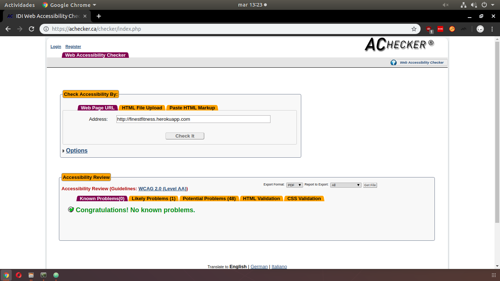

# Anexos

**(R34) Validación HTML5, CSS3 y accesibilidad**

**Prueba del seis**

¿Qué sitio es éste?
FinestFitness.
En el menú de navegación, en la parte superior izquierda, siempre se puede ver el nombre de la app. También en el píe de página, por lo que siempre está visible.

¿En qué página estoy?
Todas las páginas cuentan con migas de pan, también el título de la página te indica dónde te encuentras.

¿Cuales son las principales secciones del sitio?
- Home
- Horarios
- Tarifas
- Clases
- Entrenos
- Administradores
- Monitores
- Clientes
- Rutinas
- Login (en caso de no haber iniciado sesión)

Esas serían las principales secciones, algunas sólo son visibles y accesibles para cierto tipo de usuarios.

¿Qué opciones tengo en este nivel?

Puedes navegar clicando en botones o enlaces.

¿Dónde estoy en el esquema de las cosas?

El usuario puede ver en todo momento dónde se encuentra gracias a las migas de pan, situadas en la parte superior de la página.

¿Cómo busco algo?

La aplicación no cuenta con un buscador general, pero puedes buscar dentro de las tablas donde se visualizan los datos, escribiendo en un campo de búsqueda.

**(R36) Varios navegadores**

